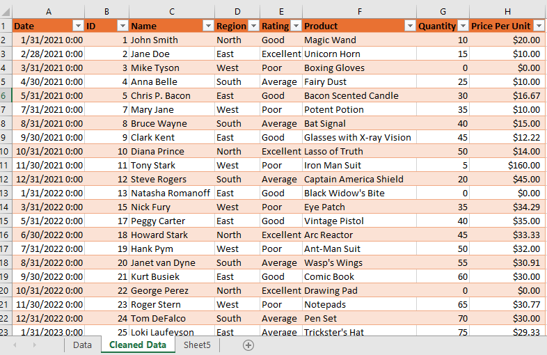

# Data Cleaning and Organizing (Excel Project)

## Overview
This project basically involves cleaning and organizing the data 
using Microsoft Excel to be ready and reliable for analysis. Dealing with 
inconsistent entries, spacing issues, missing or incorrect values, and 
more. 

---

## Tools Used
- Microsoft Excel  

---

## Files in this Repository
- Sales_Data.xlsx → Cleaned dataset  
- Sales_Data_Report.pdf → Full project report with detailed insights  
- dashboard.png → Screenshot of Excel dashboard  

---

## Process
1. Data Cleaning (handling missing values, formatting, removing duplicates, using text functions to filtering, sorting, and logical 
formulas. etc.)   
2. Insights & Recommendations  

---  

## Dashboard Preview

---

## ✅ Conclusion
This project demonstrates my ability to clean data, use text functions,filtering,sorting and logical 
formulas in Excel. Making data ready and consistent for analysis.

---

 **Author**: Idayat Shalewa Salako  

